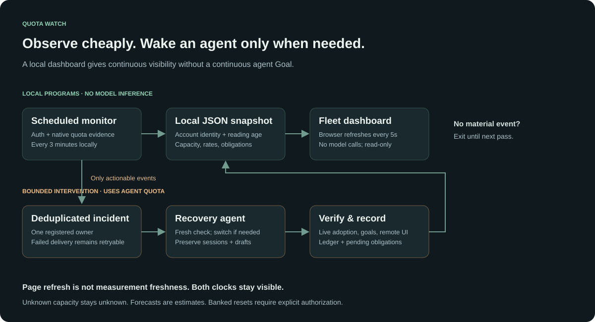
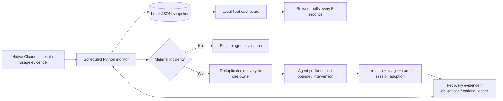

# Event-driven quota recovery

The scheduler, monitor, JSON writes, HTTP server and browser polling are deterministic programs. They do not invoke a language model. Native auth/usage checks may contact the provider, but should not send inference prompts. The agent consumes quota when a delivered incident prompts it to reason or interact with the browser/terminal.

This separates **observation** from **intervention**. A continuous agent Goal is unnecessary for routine monitoring. The public collector reads current native caches; stale measurements cause a refresh incident unless your deployment already provides a native usage sampler. The original deployment uses disposable native `/usage` probes in its scheduled monitor.

Two clocks stay visible: the last monitor pass and the last successful measurement for each account. A five-second dashboard refresh cannot make an old reading fresh. Forecasts require distinct, account-bound samples and are invalidated by stale readings, a reset or an identity change.

One registered owner handles account mutations; a transaction lock prevents overlapping monitor runs. The lock does not serialize an entire agent conversation, so interventions must also be handled sequentially by that owner. Failed notification remains retryable. Successful queueing is not proof that recovery happened: adoption, remote access, goals and ledger updates have separate evidence and obligations.

The dashboard is served on loopback only, with no remote scripts, model calls or write endpoints. It displays selected quota data and obligation reasons; treat those as private local information. The public repository contains synthetic tests and generic instructions only.
